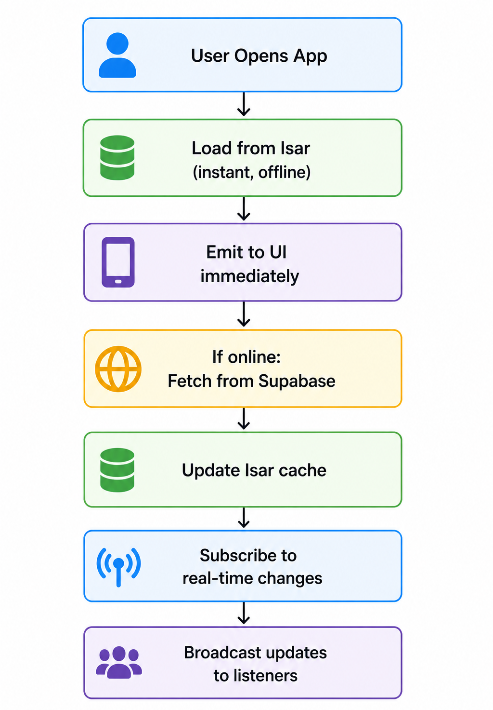
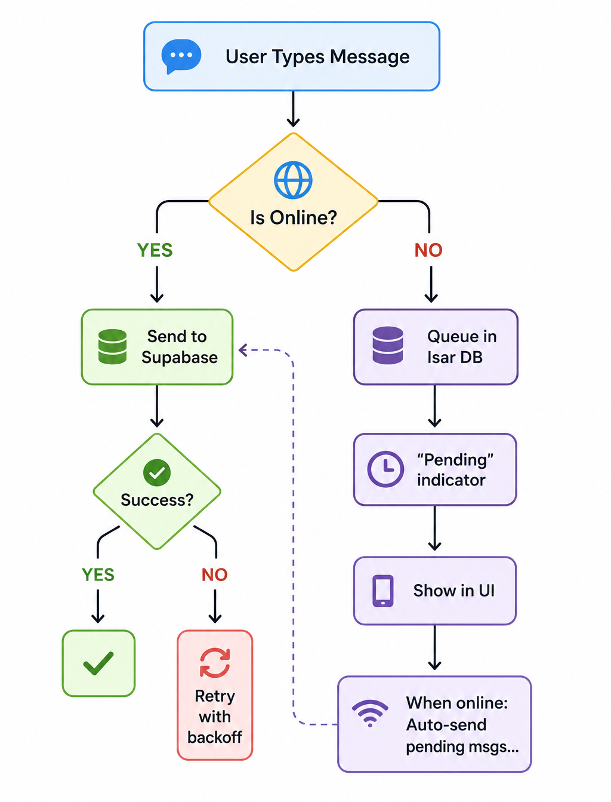
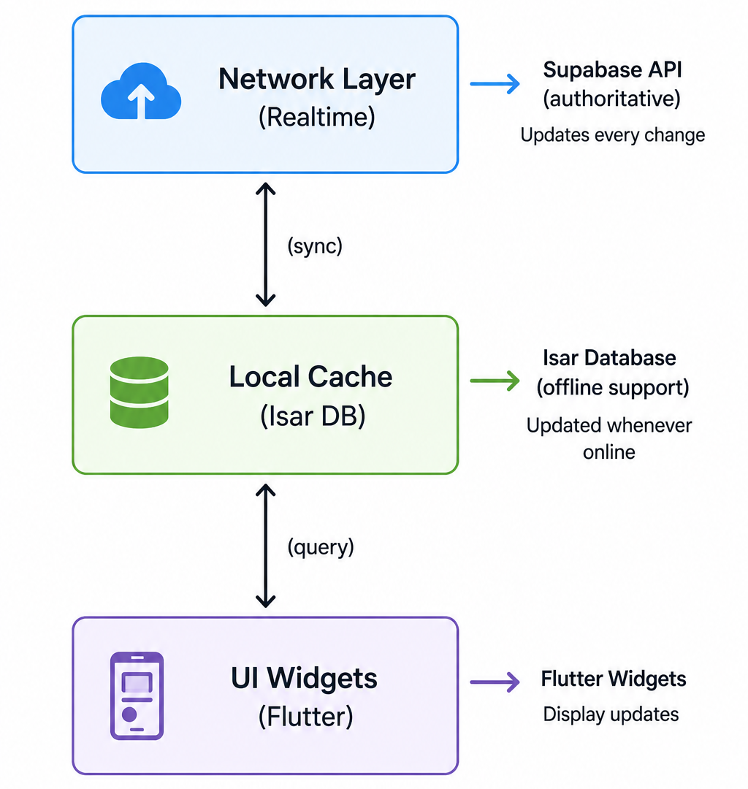
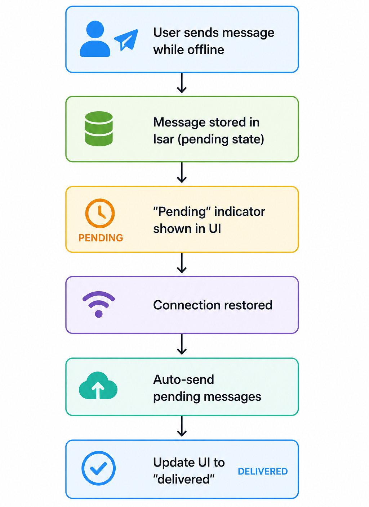

# UniSync 

**A Production-Grade University Management Mobile Application**

UniSync is a comprehensive Flutter-based mobile platform that connects university students with real-time announcements, event management, course resources, and peer-to-peer communication. Built with offline-first architecture, it ensures seamless functionality even without internet connectivity.

---

## Table of Contents

1. [Project Overview](#project-overview)
2. [Core Functionalities](#core-functionalities)
3. [Project Structure](#project-structure)
4. [API Documentation](#api-documentation)
5. [Tech Stack](#tech-stack)
6. [Installation & Setup](#installation--setup)
7. [Environment Configuration](#environment-configuration)
8. [Building & Deployment](#building--deployment)

---

## Project Overview

### What is UniSync?

UniSync bridges the gap between academic institutions and students by providing a centralized platform for:

- **Real-time Communication** - Instant announcements, notifications, and peer-to-peer chat
- **Event Management** - Discover and RSVP to campus events with calendar integration
- **Course Resources** - Share and access study materials, past papers, and course notes
- **Offline-First Support** - Complete functionality without internet, automatic sync when reconnected
- **Push Notifications** - Firebase Cloud Messaging + OneSignal for instant alerts
- **User Authentication** - University email-based registration with secure JWT authentication

### Key Features

- **University Email Authentication** - Only .edu, .edu.bd, .ac.bd, .ac.uk, .ac.in domains  
- **Real-time Announcements** - Department-wide notifications with type filtering  
- **Event Calendar** - Create, discover, and RSVP to campus events  
- **Course Resources** - Upload and download study materials with metadata  
- **Direct Messaging** - One-to-one chat with presence tracking and offline queue  
- **User Profiles** - Customizable student profiles with profile pictures  
- **Offline Mode** - Complete functionality offline, automatic sync when online  
- **Push Notifications** - FCM + OneSignal for critical announcements  
- **Connectivity Monitoring** - Automatic sync triggers when connection restored  
- **Role-Based Access** - Student-focused interface with admin capabilities  

### Technology Highlights

- **Framework**: Flutter 3.2.0+ (iOS & Android)
- **Backend**: Supabase (PostgreSQL, Real-time, Storage)
- **Authentication**: JWT via Supabase Auth
- **Local Database**: Isar NoSQL (offline-first)
- **State Management**: Flutter Riverpod
- **Push Notifications**: Firebase Cloud Messaging + OneSignal
- **Real-time Sync**: Supabase Realtime (WebSocket)

### Target Users

- University students
- Academic departments
- Campus organizations
- Administrative staff (admin role)

---

## Core Functionalities

### 1. Authentication Module

**User Registration**
```
POST /auth/signup
Body: {
  name: string (1-255 chars),
  email: string (must end with .edu, .edu.bd, .ac.bd, .ac.uk, .ac.in),
  password: string (min 8 chars),
  department: string,
  semester: number (1-8),
  studentId: string
}
Response: AppUser object with UID and JWT token
```

**Features**:
- University email domain validation
- Secure password hashing (bcrypt)
- Automatic JWT token generation
- Session persistence
- Password reset via email
- Role-based access (student default, admin optional)

**Example Flow**:
```
1. User enters university email + password
2. Client validates format
3. Supabase Auth creates user account
4. Database trigger automatically assigns 'student' role
5. User profile created in 'users' table
6. JWT token returned to client
7. Token stored in device memory (session)
8. Refresh token stored in secure storage
```

---

### 2. Announcements System

**Real-time Announcement Streaming**
```
GET /announcements?type=Academic
Returns: Stream<List<Announcement>>

Announcement Object: {
  id: UUID,
  title: string,
  content: string,
  type: enum (Academic, Administrative, General, Other),
  department: string,
  authorId: UUID,
  authorName: string,
  postedAt: timestamp,
  updatedAt: timestamp
}
```

**Architecture**:
1. **Client-side Caching** (Isar Database)
   - Immediate data availability
   - Supports offline viewing
   - Auto-updated when online

2. **Real-time Subscription** (Supabase Realtime)
   - Live updates via WebSocket
   - 10-second fetch timeout
   - Automatic reconnection

3. **Data Sync Flow**:
   

**Features**:
- Type-based filtering (Academic, Administrative, General, Other)
- Department-specific announcements
- Push notification triggers for new announcements
- Full-text search capability
- Offline access to cached announcements
- Real-time updates when online

**Example Usage**:
```dart
// Get all announcements
announcementService.getAnnouncements().listen((announcements) {
  print("${announcements.length} announcements available");
});

// Get only academic announcements
announcementService.getAnnouncements(type: "Academic")
  .listen((academicAnns) {
    academicAnns.forEach((ann) => print(ann.title));
  });

// Create announcement (admin/author only)
await announcementService.postAnnouncement(
  title: "Final Exam Schedule",
  content: "Finals start June 1st...",
  type: "Academic",
  department: "Computer Science",
);
```

---

### 3. Chat & Messaging

**One-to-One Direct Messaging**
```
POST /chat/rooms/create
Body: {
  userId1: UUID,
  userId2: UUID
}
Response: { roomId: UUID }

POST /chat/messages/send
Body: {
  roomId: UUID,
  userId: UUID,
  content: string (1-2000 chars)
}
Response: { messageId: UUID, sentAt: timestamp }
```

**Features**:
- Real-time message delivery
- Message read status tracking
- Delivery status indicators
- Offline message queue (auto-sync when online)
- Online/offline presence indicators
- Typing indicators
- Message history pagination

**Data Flow**:



**Example Usage**:
```dart
// Create chat room
final roomId = await chatService.createChatRoom(
  userId1: currentUser.uid,
  userId2: selectedUser.uid,
);

// Send message
await chatService.sendMessage(
  roomId: roomId,
  userId: currentUser.uid,
  content: "Hey, how are you doing?",
);

// Listen to messages
chatService.getRoomMessages(roomId).listen((messages) {
  messages.forEach((msg) {
    print("${msg.senderName}: ${msg.content}");
  });
});

// Mark message as read
await chatService.markAsRead(messageId);

// Join presence (show online status)
await chatService.joinPresence(currentUser.uid, currentUser.name);
```

---

### 4. Event Management

**Create and Manage Campus Events**
```
POST /events/create
Body: {
  title: string (1-200 chars),
  description: string (1-5000 chars),
  startTime: timestamp,
  endTime: timestamp,
  location: string (1-300 chars),
  organizer: string
}
Response: { eventId: UUID }

POST /events/{eventId}/rsvp
Body: {
  status: enum (going, interested, not_going)
}
Response: { rsvpCount: number }
```

**Features**:
- Event creation with full details
- RSVP functionality (going, interested, not going)
- Calendar integration
- Event discovery and filtering
- Attendee list viewing
- Real-time RSVP count updates
- Event deletion (organizer only)
- Offline event caching

**Example Usage**:
```dart
// Get all events
eventService.getEvents().listen((events) {
  events.forEach((event) {
    print("${event.title} on ${event.startTime}");
  });
});

// Create event
await eventService.createEvent(
  title: "Spring Tech Conference",
  description: "Annual conference with keynotes...",
  startTime: DateTime(2026, 5, 15, 9, 0),
  endTime: DateTime(2026, 5, 15, 17, 0),
  location: "Main Auditorium",
  organizer: "Computer Science Club",
);

// RSVP to event
await eventService.rsvpEvent(
  eventId: eventId,
  status: "going",
);

// Get event details with attendees
final event = await eventService.getEventDetails(eventId);
print("${event.rsvpCount} people attending");
```

---

### 5. Course Resources

**Share and Access Study Materials**
```
POST /resources/upload
Body (multipart): {
  file: binary (max 50MB),
  filename: string,
  department: string,
  category: enum (Notes, Papers, Books, etc.),
  description: string
}
Response: { resourceId: UUID, fileUrl: string }

GET /resources?department=CS&category=Notes
Returns: Stream<List<Resource>>
```

**Features**:
- File upload (PDFs, documents, images)
- File preview and download
- Category-based organization (Notes, Past Papers, Books, Syllabus)
- Department-specific resources
- Full-text search
- Download history
- Offline access to cached resources
- File metadata tracking (size, type, upload date)

**Supported File Types**:
- PDF, DOC, DOCX, PPT, PPTX
- XLS, XLSX
- PNG, JPG, JPEG
- Max size: 50 MB per file

**Example Usage**:
```dart
// Upload resource
final image = await ImagePicker().pickImage(source: ImageSource.gallery);
final bytes = await image.readAsBytes();

await resourceService.uploadResource(
  filename: "Data Structures - Chapter 5.pdf",
  fileBytes: bytes,
  department: "Computer Science",
  category: "Notes",
  description: "Lecture notes from CS-201 Week 5",
);

// Get resources
resourceService.getResources(
  department: "Computer Science",
  category: "Notes",
).listen((resources) {
  resources.forEach((resource) {
    print("${resource.filename} - ${resource.uploadedAt}");
  });
});

// Download resource
final fileBytes = await resourceService.downloadResource(resource.fileUrl);
// Save to device or open in viewer

// Search resources
resourceService.searchResources(
  query: "algorithms",
  department: "Computer Science",
).listen((results) {
  print("Found ${results.length} resources");
});
```

---

### 6. Push Notifications

**Multi-Channel Notification System**
```
Firebase Cloud Messaging (FCM):
- Base infrastructure for push delivery
- Device token management
- Topic-based subscriptions

OneSignal:
- Wrapper around FCM
- Advanced notification features
- Segmentation and targeting
- Analytics and tracking
```

**Notification Types**:
- **Announcements** - New announcement published
- **Chat** - New message received
- **Events** - Event invitation or update
- **System** - App updates, maintenance

**Topic Subscription Example**:
```dart
// Subscribe to department announcements
await notificationService.subscribeToTopic("department_cs");

// Subscribe to announcement types
await notificationService.subscribeToTopic("announcement_academic");

// Subscribe to event notifications
await notificationService.subscribeToTopic("events_campus");

// Subscribe to user-specific notifications
await notificationService.subscribeToTopic("user_${userId}");
```

---

### 7. Offline-First Architecture

**Three-Tier Data Strategy**:


**Offline Message Queue**:


**Cache Strategy**:
- Load cached data immediately (< 50ms)
- Emit cached data to UI first (optimistic)
- Fetch fresh data from server in background
- Update cache and re-emit when fresh data arrives
- Subscribe to real-time updates for live changes

---

## Project Structure

```
unisync/
│
├── lib/                                 # Main application code
│   ├── main.dart                       # App entry point & initialization
│   │
│   ├── models/                         # Data models
│   │   ├── user_model.dart
│   │   ├── announcement_model.dart
│   │   ├── chat_model.dart
│   │   ├── event_model.dart
│   │   ├── resource_model.dart
│   │   ├── isar_announcement.dart      # Generated Isar models
│   │   ├── isar_chat.dart
│   │   ├── isar_event.dart
│   │   ├── isar_resource.dart
│   │   └── isar_user.dart
│   │
│   ├── services/                        # Business logic layer
│   │   ├── auth_service.dart           # Authentication (sign up, login, password reset)
│   │   ├── announcement_service.dart   # Announcements (CRUD, streaming, caching)
│   │   ├── chat_service.dart           # Chat messaging (send, receive, presence)
│   │   ├── event_service.dart          # Events (create, RSVP, calendar)
│   │   ├── resource_service.dart       # Resources (upload, download, search)
│   │   ├── profile_service.dart        # User profile management
│   │   ├── notification_service.dart   # FCM + OneSignal setup
│   │   ├── local_database_service.dart # Isar cache operations
│   │   ├── connectivity_service.dart   # Network monitoring
│   │   ├── marking_service.dart        # User activity tracking
│   │   ├── supabase_client.dart        # Supabase initialization
│   │   └── ...
│   │
│   ├── providers/                       # Riverpod state management
│   │   ├── auth_provider.dart
│   │   ├── announcement_provider.dart
│   │   ├── chat_provider.dart
│   │   ├── event_provider.dart
│   │   ├── resource_provider.dart
│   │   ├── connectivity_provider.dart
│   │   └── ...
│   │
│   ├── screens/                         # UI Pages
│   │   ├── auth/
│   │   │   ├── login_screen.dart
│   │   │   └── signup_screen.dart
│   │   ├── onboarding/
│   │   │   └── onboarding_screen.dart
│   │   ├── dashboard/
│   │   │   ├── main_dashboard.dart     # Bottom navigation host
│   │   │   ├── home_tab.dart
│   │   │   └── announcements_screen.dart
│   │   ├── chat/
│   │   │   ├── chat_list_screen.dart
│   │   │   ├── chat_room_screen.dart
│   │   │   └── new_chat_screen.dart
│   │   ├── events/
│   │   │   ├── events_list_screen.dart
│   │   │   ├── event_detail_screen.dart
│   │   │   └── event_creation_screen.dart
│   │   ├── resources/
│   │   │   ├── resources_screen.dart
│   │   │   ├── resource_detail_screen.dart
│   │   │   └── resource_upload_screen.dart
│   │   └── profile/
│   │       ├── profile_screen.dart
│   │       └── edit_profile_screen.dart
│   │
│   ├── widgets/
│   │   └── shared_widgets.dart          # Reusable UI components
│   │
│   └── theme/
│       └── app_theme.dart              # Material Design theme
│
├── supabase/                            # Backend configuration
│   └── functions/
│       └── send-notification/
│           └── index.ts                # Edge function for notifications
│
├── android/                             # Android native code
│   ├── app/
│   │   ├── build.gradle
│   │   ├── google-services.json        # Firebase config
│   │   └── src/
│   │       └── main/
│   │           ├── AndroidManifest.xml
│   │           └── kotlin/
│   │               └── MainActivity.kt
│   └── gradle/
│
├── assets/
│   └── images/
│       ├── logo.png
│       ├── background.jpg
│       ├── app_icon.png
│       └── ...
│
├── test/                                # Unit & widget tests
│   ├── services/
│   ├── screens/
│   └── ...
│
├── pubspec.yaml                         # Flutter dependencies
├── pubspec.lock                         # Locked dependency versions
├── .env                                 # Environment variables (NEVER commit)
├── .env.example                         # Environment template
├── .gitignore                           # Git ignore rules
├── analysis_options.yaml                # Lint rules
├── SUPABASE_SETUP.sql                   # Database schema
├── NOTIFICATIONS_SETUP.sql              # Notification system schema
├── COMPLETE_SETUP_GUIDE.txt             # Firebase setup guide
├── README_FIREBASE_BUILD.txt            # Firebase build instructions
└── build_run.ps1                        # Windows build script
```

### Directory Purposes

**lib/models** - Pure data classes representing API responses and local DB entities. Isar models are auto-generated.

**lib/services** - Core business logic layer. Each service handles one domain (auth, chat, events) and manages both Supabase and Isar data.

**lib/providers** - Riverpod providers expose services and manage state. Widgets listen to changes and rebuild automatically.

**lib/screens** - Flutter widgets making up the UI. Each screen represents a major feature or page.

**lib/widgets** - Reusable UI components (cards, buttons, loaders) used across multiple screens.

**supabase/functions** - Edge Functions (TypeScript) running on Supabase backend for server-side logic.

**android/ & ios/** - Platform-specific native code and configuration.

---

## API Documentation

### Service Layer Architecture

All API operations are exposed through service classes that handle both remote (Supabase) and local (Isar) data sources.

### Authentication Service

#### 1. Sign Up

```dart
Future<AppUser> signUp({
  required String name,
  required String email,
  required String password,
  required String department,
  required String semester,
  required String studentId,
})
```

**Request Example**:
```dart
final user = await authService.signUp(
  name: "John Doe",
  email: "john.doe@university.edu",
  password: "MySecurePass123",
  department: "Computer Science",
  semester: "6",
  studentId: "CS-20210001",
);
```

**Response**:
```dart
AppUser {
  uid: "550e8400-e29b-41d4-a716-446655440000",
  name: "John Doe",
  email: "john.doe@university.edu",
  department: "Computer Science",
  semester: "6",
  studentId: "CS-20210001",
  role: "student", // Set by DB trigger
  profilePictureUrl: null,
  createdAt: 2026-05-04T10:30:00Z,
  updatedAt: 2026-05-04T10:30:00Z
}
```

**Validation**:
- Email must end with: .edu, .edu.bd, .ac.bd, .ac.uk, .ac.in
- Password minimum 8 characters
- Name, department, semester required
- StudentId must be unique

**Error Responses**:
```dart
"Must be a university email"           // Invalid domain
"Password must be at least 8 characters" // Too short
"Email already exists"                 // Duplicate
"Sign up failed"                       // Server error
```

---

#### 2. Sign In

```dart
Future<AppUser> signIn(String email, String password)
```

**Request Example**:
```dart
final user = await authService.signIn(
  "john.doe@university.edu",
  "MySecurePass123",
);
```

**Response**: Same as Sign Up

**Session Management**:
- Access token stored in memory (1 hour validity)
- Refresh token stored in device secure storage (30 days)
- Auto-refresh on token expiry
- Session persists across app restarts

---

#### 3. Sign Out

```dart
Future<void> signOut()
```

Clears session, revokes tokens, and returns user to login screen.

---

### Announcement Service

#### Get Announcements Stream

```dart
Stream<List<Announcement>> getAnnouncements({String? type})
```

**Parameters**:
- `type` (optional): "Academic", "Administrative", "General", "Other", or null for all

**Returns**: Real-time stream of announcements

**Example**:
```dart
// Get all announcements
announcementService.getAnnouncements().listen((announcements) {
  setState(() => this.announcements = announcements);
});

// Get filtered announcements
announcementService.getAnnouncements(type: "Academic").listen((anns) {
  print("${anns.length} academic announcements");
});
```

**Data Flow**:
1. Load from Isar cache (immediate)
2. Emit cached data to UI
3. If online, fetch from Supabase
4. Update cache with fresh data
5. Re-emit to UI
6. Subscribe to Realtime for live updates

---

#### Post Announcement

```dart
Future<void> postAnnouncement({
  required String title,
  required String content,
  required String type,
  required String department,
})
```

**Example**:
```dart
await announcementService.postAnnouncement(
  title: "Spring Semester Begins",
  content: "Spring semester starts on January 15th...",
  type: "Academic",
  department: "All",
);
```

---

### Chat Service

#### Get Chat Rooms

```dart
Stream<List<ChatRoom>> getChats({required String userId})
```

**Returns**: List of all conversation threads

**Example**:
```dart
chatService.getChats(userId: currentUser.uid).listen((rooms) {
  setState(() => chatRooms = rooms);
});
```

---

#### Get Room Messages

```dart
Stream<List<ChatMessage>> getRoomMessages(String roomId)
```

**Returns**: Stream of all messages in a room, sorted by sent time

**Message Object**:
```dart
ChatMessage {
  id: "msg-uuid",
  roomId: "room-uuid",
  senderId: "user-uuid",
  senderName: "John Doe",
  content: "Hi, how are you?",
  isDelivered: true,
  isRead: true,
  sentAt: 2026-05-04T10:00:00Z,
  createdAt: 2026-05-04T10:00:00Z
}
```

---

#### Send Message

```dart
Future<void> sendMessage({
  required String roomId,
  required String userId,
  required String content,
})
```

**Features**:
- Offline message queueing
- Auto-retry with exponential backoff
- Auto-send when connectivity restored
- Optimistic UI (show immediately)

**Example**:
```dart
await chatService.sendMessage(
  roomId: "room-uuid",
  userId: currentUser.uid,
  content: "See you at 3pm!",
);
```

---

### Event Service

#### Get Events

```dart
Stream<List<Event>> getEvents()
```

**Returns**: Stream of all future events, sorted by date

**Event Object**:
```dart
Event {
  id: "event-uuid",
  title: "Spring Tech Conference",
  description: "Annual conference featuring keynote speakers...",
  startTime: 2026-05-15T09:00:00Z,
  endTime: 2026-05-15T17:00:00Z,
  location: "Main Auditorium",
  organizerId: "user-uuid",
  organizerName: "Computer Science Club",
  rsvpCount: 234,
  userRsvpStatus: "going", // null if not rsvped
  createdAt: 2026-05-04T10:00:00Z,
  updatedAt: 2026-05-04T10:00:00Z
}
```

---

#### Create Event

```dart
Future<void> createEvent({
  required String title,
  required String description,
  required DateTime startTime,
  required DateTime endTime,
  required String location,
  required String organizer,
})
```

**Validation**:
- Title: 1-200 characters
- Description: 1-5000 characters
- startTime < endTime
- location: 1-300 characters

---

#### RSVP to Event

```dart
Future<void> rsvpEvent({
  required String eventId,
  required String status, // going, interested, not_going
})
```

**Updates RSVP count and broadcasts via Realtime**

---

### Resource Service

#### Upload Resource

```dart
Future<void> uploadResource({
  required String filename,
  required Uint8List fileBytes,
  required String department,
  required String category,
  required String description,
})
```

**File Validation**:
- Max size: 50 MB
- Supported types: PDF, DOC, DOCX, PPT, PPTX, XLS, XLSX, PNG, JPG, JPEG

**Categories**: Notes, Past Papers, Books, Syllabus, Assignment, Code, Video

**Example**:
```dart
final file = await FilePicker.platform.pickFiles();
await resourceService.uploadResource(
  filename: "Data Structures - Chapter 5.pdf",
  fileBytes: file.files.first.bytes!,
  department: "Computer Science",
  category: "Notes",
  description: "Lecture notes from CS-201 Week 5",
);
```

---

#### Get Resources

```dart
Stream<List<Resource>> getResources({
  String? department,
  String? category,
})
```

**Returns**: Filtered stream of resources

**Resource Object**:
```dart
Resource {
  id: "resource-uuid",
  filename: "Data Structures - Chapter 5.pdf",
  fileUrl: "https://storage.supabase.co/...",
  fileType: "application/pdf",
  fileSize: 2097152, // bytes
  department: "Computer Science",
  category: "Notes",
  description: "Lecture notes from CS-201 Week 5",
  uploaderId: "user-uuid",
  uploaderName: "Prof. Smith",
  uploadedAt: 2026-05-01T10:00:00Z
}
```

---

#### Download Resource

```dart
Future<Uint8List> downloadResource(String fileUrl)
```

**Returns**: File bytes for viewing or saving locally

---

### User Profile Service

#### Get User Profile

```dart
Future<AppUser> getUserProfile(String userId)
```

**Returns**: Complete user profile with all details

---

#### Update Profile

```dart
Future<void> updateProfile({
  String? name,
  String? semester,
  String? profilePictureUrl,
})
```

**Updatable Fields**:
- name (1-255 chars)
- semester (1-8)
- profilePictureUrl (from upload)

**Protected Fields** (immutable):
- Email
- Student ID
- Department
- Role

---

#### Upload Profile Picture

```dart
Future<String> uploadProfilePicture(Uint8List imageBytes)
```

**Validation**:
- Format: PNG, JPG, JPEG only
- Max size: 5 MB
- Auto-scaled to 500x500

**Returns**: Supabase Storage URL

---

### Notification Service

#### Initialize Notifications

```dart
Future<void> initialize(String oneSignalAppId)
```

**Called in main()** before any other operations

**Setup Steps**:
1. Initialize Firebase Cloud Messaging
2. Initialize OneSignal
3. Request notification permissions
4. Set up notification handlers
5. Upload device token

---

#### Subscribe to Topic

```dart
Future<void> subscribeToTopic(String topic)
```

**Common Topics**:
- `department_cs` - Computer Science announcements
- `announcement_academic` - Academic announcements
- `events_campus` - Campus events
- `user_{uid}` - Personal notifications

**Example**:
```dart
await notificationService.subscribeToTopic("department_cs");
await notificationService.subscribeToTopic("announcement_academic");
```

---

## Tech Stack

### Frontend

| Component | Technology | Version |
|-----------|-----------|---------|
| Framework | Flutter | 3.2.0+ |
| Language | Dart | 3.2.0+ |
| State Management | Flutter Riverpod | 2.6.1 |
| Local Database | Isar | 3.1.0+ |
| Backend | Supabase Flutter | 2.5.0 |

### Backend Services

| Service | Purpose | Version |
|---------|---------|---------|
| PostgreSQL | Relational database | Latest |
| Supabase Auth | JWT authentication | Latest |
| Supabase Realtime | WebSocket subscriptions | Latest |
| Firebase Cloud Messaging | Push notifications | Latest |
| OneSignal | Notification management | 5.2.5 |

### UI Libraries

| Library | Purpose |
|---------|---------|
| google_fonts | Typography |
| table_calendar | Calendar widget |
| cached_network_image | Image optimization |
| shimmer | Loading animations |
| smooth_page_indicator | Page indicators |

---

## Installation & Setup

### Prerequisites

```bash
# Flutter SDK
flutter --version  # Should be 3.2.0+

# Dart SDK
dart --version    # Should be 3.2.0+

# Android SDK (for Android development)
# API Level 21 or higher

# Git
git --version

# Accounts needed:
# - Supabase (free tier available)
# - Firebase (for OneSignal)
# - OneSignal (for notifications)
```

### Step 1: Clone Repository

```bash
git clone https://github.com/yourusername/unisync.git
cd unisync
```

### Step 2: Install Dependencies

```bash
# Get Flutter packages
flutter pub get

# Generate Isar models
dart run build_runner build --delete-conflicting-outputs
```

### Step 3: Configure Supabase

1. Create Supabase project at https://app.supabase.com
2. Note your **Project URL** and **Anon Key**
3. Run database schema SQL in Supabase SQL Editor:
   ```bash
   cat SUPABASE_SETUP.sql
   ```
4. Enable Realtime for tables:
   - announcements
   - chat_messages
   - events
   - event_rsvps

### Step 4: Configure Firebase

1. Create Firebase project at https://console.firebase.google.com
2. Create Android app
3. Download `google-services.json`
4. Place at: `android/app/google-services.json`

### Step 5: Configure OneSignal

1. Create OneSignal account at https://onesignal.com
2. Create new app (Android)
3. Get **App ID** from Settings → Keys & IDs
4. Link Firebase credentials

### Step 6: Create .env File

```bash
# Copy template
cp .env.example .env

# Edit with your values
nano .env  # or use your editor
```

Add:
```env
SUPABASE_URL=https://your-project.supabase.co
SUPABASE_ANON_KEY=eyJhbGciOiJIUzI1NiIsInR5cCI6IkpXVCJ9...
ONESIGNAL_APP_ID=12345678-1234-1234-1234-123456789012
```

### Step 7: Run the App

```bash
# Run on device
flutter run

# Run with verbose logging
flutter run -v

# Build APK
flutter build apk --release

# Build App Bundle (Play Store)
flutter build appbundle --release
```

---

## Environment Configuration

### Supabase Setup

**Create Tables** (run in Supabase SQL Editor):

```sql
-- Users table
CREATE TABLE users (
  id UUID PRIMARY KEY (from auth.users),
  name TEXT NOT NULL,
  email TEXT UNIQUE NOT NULL,
  department TEXT,
  semester TEXT,
  student_id TEXT UNIQUE,
  role TEXT DEFAULT 'student',
  profile_picture_url TEXT,
  created_at TIMESTAMP DEFAULT NOW(),
  updated_at TIMESTAMP DEFAULT NOW()
);

-- Announcements table
CREATE TABLE announcements (
  id UUID PRIMARY KEY DEFAULT gen_random_uuid(),
  title TEXT NOT NULL,
  content TEXT NOT NULL,
  type TEXT DEFAULT 'General',
  department TEXT,
  author_id UUID REFERENCES users(id),
  posted_at TIMESTAMP DEFAULT NOW(),
  updated_at TIMESTAMP DEFAULT NOW()
);

-- Chat rooms
CREATE TABLE chat_rooms (
  id UUID PRIMARY KEY DEFAULT gen_random_uuid(),
  participant_ids JSONB,
  last_message_at TIMESTAMP,
  created_at TIMESTAMP DEFAULT NOW()
);

-- Chat messages
CREATE TABLE chat_messages (
  id UUID PRIMARY KEY DEFAULT gen_random_uuid(),
  room_id UUID REFERENCES chat_rooms(id),
  sender_id UUID REFERENCES users(id),
  content TEXT NOT NULL,
  is_delivered BOOLEAN DEFAULT false,
  is_read BOOLEAN DEFAULT false,
  sent_at TIMESTAMP DEFAULT NOW(),
  created_at TIMESTAMP DEFAULT NOW()
);

-- Events table
CREATE TABLE events (
  id UUID PRIMARY KEY DEFAULT gen_random_uuid(),
  title TEXT NOT NULL,
  description TEXT,
  start_time TIMESTAMP,
  end_time TIMESTAMP,
  location TEXT,
  organizer_id UUID REFERENCES users(id),
  created_at TIMESTAMP DEFAULT NOW(),
  updated_at TIMESTAMP DEFAULT NOW()
);

-- Resources table
CREATE TABLE resources (
  id UUID PRIMARY KEY DEFAULT gen_random_uuid(),
  filename TEXT NOT NULL,
  file_url TEXT NOT NULL,
  department TEXT,
  category TEXT,
  description TEXT,
  uploader_id UUID REFERENCES users(id),
  file_size INTEGER,
  file_type TEXT,
  uploaded_at TIMESTAMP DEFAULT NOW()
);
```

**Enable Row-Level Security (RLS)**:

```sql
-- Enable RLS on all tables
ALTER TABLE users ENABLE ROW LEVEL SECURITY;
ALTER TABLE announcements ENABLE ROW LEVEL SECURITY;
ALTER TABLE chat_messages ENABLE ROW LEVEL SECURITY;
ALTER TABLE events ENABLE ROW LEVEL SECURITY;
ALTER TABLE resources ENABLE ROW LEVEL SECURITY;

-- Policy: Users can read announcements
CREATE POLICY "Allow all users to read announcements"
ON announcements FOR SELECT USING (true);

-- Policy: Only author can update own announcements
CREATE POLICY "Only author can update own announcement"
ON announcements FOR UPDATE
USING (auth.uid() = author_id);
```

**Enable Realtime**:

Go to **Database** → **Publications** → Enable for:
- announcements
- chat_messages
- events
- event_rsvps (if using separate table)

---

### Environment Variables Template

```env
# Supabase
SUPABASE_URL=https://your-project.supabase.co
SUPABASE_ANON_KEY=your-anon-key-here

# OneSignal (for push notifications)
ONESIGNAL_APP_ID=your-onesignal-app-id
```

**Never commit .env to version control!**

---

## Building & Deployment

### Development Build

```bash
# Debug build for testing
flutter run

# Hot reload during development
Press 'r' during flutter run
```

### Release Build - Android

```bash
# Clean build
flutter clean

# Get dependencies
flutter pub get

# Generate models
dart run build_runner build --delete-conflicting-outputs

# Build APK
flutter build apk --release

# Output: build/app/outputs/apk/release/app-release.apk

# Or build App Bundle (for Play Store)
flutter build appbundle --release

# Output: build/app/outputs/bundle/release/app-release.aab
```

### Release Build - iOS

```bash
flutter build ios --release

# Then use Xcode to sign and upload
```

### Play Store Deployment

1. Sign up for Google Play Developer account
2. Create signed APK/Bundle
3. Go to [Google Play Console](https://play.google.com/console)
4. Create app entry
5. Upload signed bundle
6. Add release notes and screenshots
7. Submit for review

**Review Timeline**: 24-48 hours

### App Store Deployment

1. Sign up for Apple Developer Program
2. Create app in App Store Connect
3. Build and sign with Xcode
4. Upload to App Store Connect
5. Add release notes
6. Submit for review

**Review Timeline**: 24-48 hours

---

## Code Quality & Testing

### Run Linter

```bash
flutter analyze
```

Expected: Zero warnings/errors

### Run Tests

```bash
# All tests
flutter test

# Specific test file
flutter test test/services/auth_service_test.dart

# With coverage
flutter test --coverage
```

### Format Code

```bash
dart format lib/
```

---

## Troubleshooting

### "google-services.json not found"
```bash
# Verify file location
ls android/app/google-services.json

# If missing, download from Firebase Console
# Project Settings → Your Apps → Android app → Download
```

### "No provider found for 'supabaseClientProvider'"
```bash
# Rebuild Isar models
dart run build_runner clean
dart run build_runner build --delete-conflicting-outputs

# Clean and rebuild
flutter clean
flutter pub get
flutter run
```

### "OneSignal initialization failed"
```bash
# Ensure Firebase initialized BEFORE OneSignal in main.dart:
await Firebase.initializeApp();
await NotificationService.instance.initialize(appId);
```

### Network timeout waiting for connection
```bash
# Test Supabase connection
curl https://your-project.supabase.co/rest/v1/

# Check .env credentials
grep SUPABASE .env
```

---

## Version & Status

- **Current Version**: 1.0.0
- **Flutter Version**: 3.2.0+
- **Dart Version**: 3.2.0+
- **Status**: Production-Ready 
- **Last Updated**: May 6, 2026

---

## License

This project is licensed under the MIT License.

---

**UniSync is production-ready and fully documented for GitHub deployment!** 
