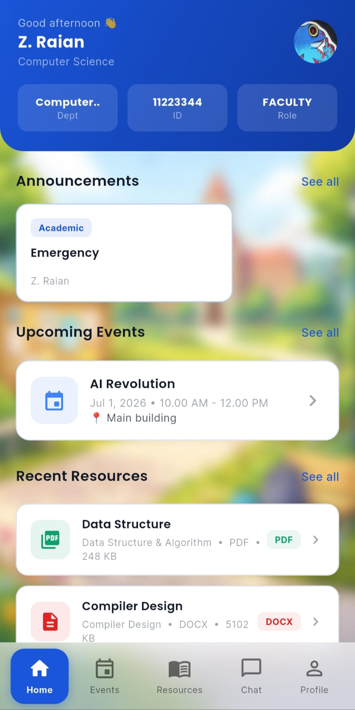
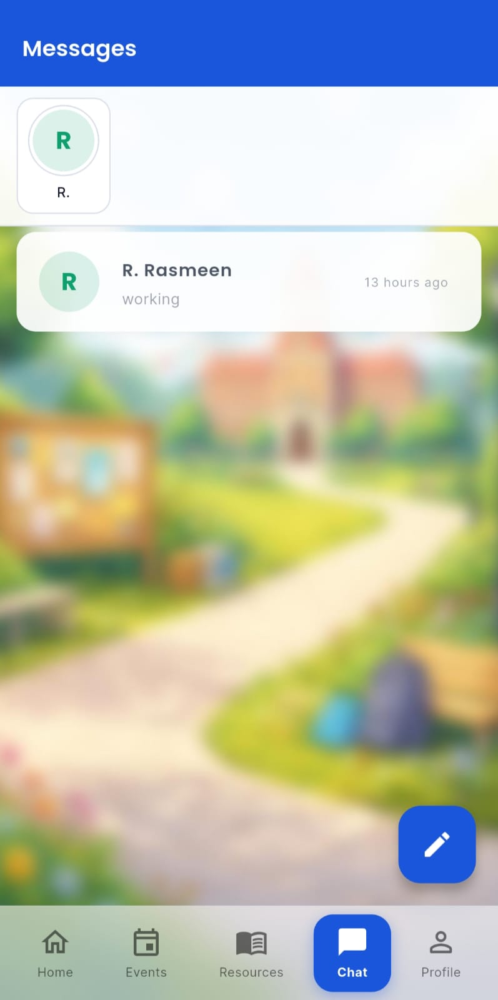
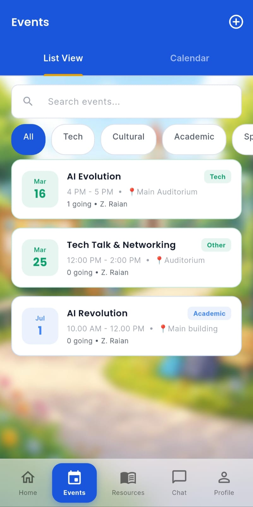
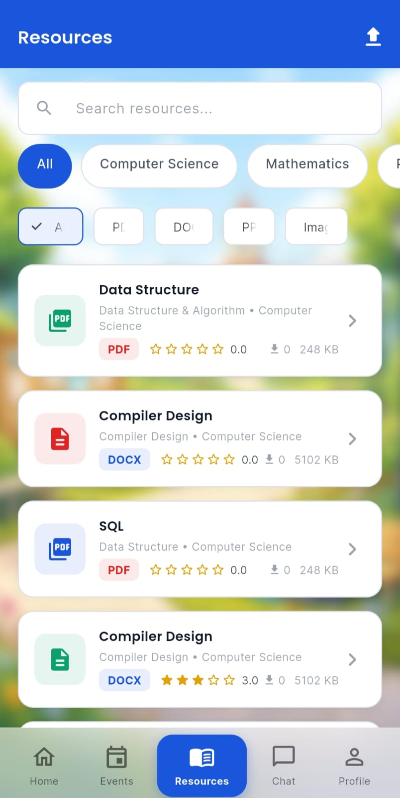
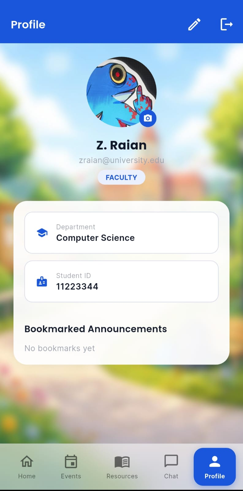

<div align="center">


# UniSync

**A Modern University Collaboration Platform**

[](https://flutter.dev)
[](https://supabase.com)
[](LICENSE)
[](https://developer.android.com)
[](https://github.com/ZannatulRaian/UniSync-Mobile-App)

</div>

---

**UniSync** is a mobile application designed to simplify communication, collaboration, and resource sharing within a university environment. It enables **students and faculty** to connect through announcements, events, messaging, and shared resources in a single unified platform with full offline support.

---

## App Preview

<p align="center">
  
  
  
</p>
<p align="center">
  <i>Home Screen • Chat System • Events Dashboard</i>
</p>
<p align="center">
  
  
</p>
<p align="center">
  <i>User Profile • Resources</i>
</p>

---

## Features

**Authentication**
- Secure sign-up and login with university email validation (`.edu`, `.edu.bd`, `.ac.bd`, `.ac.uk`, `.ac.in`)
- Role-based access automatically assigned from institutional ID (Student / Faculty)
- Password reset via email

**Announcements**
- Faculty post categorised updates — Academic, Financial, General, Club
- Students view and bookmark announcements in real time
- Type-based filtering

**Events**
- Faculty create campus events with location, date, time, and category
- Students browse events on a calendar view and RSVP with one tap
- Attendee count updated atomically via database function

**Chat**
- One-to-one and group messaging with real-time delivery
- Online presence indicators and unread message counts
- Offline message queue — messages sent while offline are delivered automatically on reconnect

**Resource Sharing**
- Upload PDFs, DOCX, PPT, and image files (up to 10 MB)
- Browse resources filtered by department, semester, and type
- Download counter and 5-star rating system

**Offline-First**
- All content cached locally with Isar; app works fully without internet
- Write operations queued and replayed automatically when connectivity returns
- Optimistic UI, actions appear instantly without waiting for the server

**Push Notifications**
- Instant alerts for new announcements, events, chat messages, and resources
- Powered by OneSignal + Firebase Cloud Messaging

---

## Tech Stack

| Layer | Technology |
|---|---|
| Framework | Flutter (Dart 3.2+) |
| Backend | Supabase- Postgres, Auth, Storage, Realtime, Edge Functions |
| Local Database | Isar (offline cache & pending-action queue) |
| State Management | Flutter Riverpod |
| Push Notifications | OneSignal + Firebase Cloud Messaging |
| Notifications Edge Function | Deno / TypeScript (Supabase Edge Function) |

---

## User Roles

| Role | Permissions |
|---|---|
| **Student** | View & bookmark announcements · Browse & RSVP events · Send & receive chat · Upload & download resources · Edit own profile |
| **Faculty** | All student permissions + Post announcements · Create events · Delete any resource |

Roles are assigned automatically at sign-up by a PostgreSQL trigger that reads the institutional ID format:

| ID Format | Role |
|---|---|
| Starts with `3`, 8 digits (e.g. `31234567`) | `student` |
| Starts with `1`, 8 digits (e.g. `11234567`) | `faculty` |

Clients cannot self-assign or escalate roles — this is enforced at the database level.

---

## Project Structure

```
unisync/
├── lib/
│   ├── main.dart                          # App entry point
│   │                                      # Init order: dotenv → Firebase → Isar
│   │                                      # → ConnectivityService → Supabase
│   │                                      # → OneSignal → ProviderScope
│   │
│   ├── models/
│   │   ├── user_model.dart                # AppUser
│   │   ├── announcement_model.dart        # Announcement
│   │   ├── chat_model.dart                # ChatRoom, ChatMessage
│   │   ├── event_model.dart               # Event
│   │   ├── resource_model.dart            # Resource
│   │   ├── isar_announcement.dart         # Isar collection schema
│   │   ├── isar_chat.dart                 # Isar collection schema (room + message)
│   │   ├── isar_event.dart                # Isar collection schema
│   │   ├── isar_resource.dart             # Isar collection schema
│   │   ├── isar_pending_action.dart       # Offline write queue schema
│   │   └── *.g.dart                       # Generated — do not edit manually
│   │
│   ├── services/
│   │   ├── auth_service.dart              # signUp · signIn · signOut · getUser
│   │   ├── announcement_service.dart      # getAnnouncements · postAnnouncement
│   │   │                                  # bookmarkToggle · deleteAnnouncement
│   │   ├── chat_service.dart              # getRooms · getMessages · sendMessage
│   │   │                                  # createRoom · presence · unread
│   │   ├── event_service.dart             # getEvents · createEvent · rsvpEvent
│   │   │                                  # deleteEvent
│   │   ├── resource_service.dart          # getResources · uploadResource
│   │   │                                  # incrementDownloads · rateResource
│   │   │                                  # deleteResource
│   │   ├── profile_service.dart           # uploadProfilePhoto · searchUsers
│   │   ├── notification_service.dart      # initialize · uploadPendingToken
│   │   │                                  # send() [static]
│   │   ├── connectivity_service.dart      # isOnline · isOffline
│   │   │                                  # onConnectionRestored callback
│   │   ├── offline_sync_service.dart      # syncAll · pendingCount
│   │   ├── marking_service.dart           # toggleResourceBookmark
│   │   │                                  # syncBookmarks
│   │   ├── local_database_service.dart    # Isar open/close + all cache ops
│   │   └── supabase_client.dart           # Supabase singleton (supabase getter)
│   │
│   ├── providers/
│   │   ├── auth_provider.dart             # authStateProvider
│   │   │                                  # currentUserProvider (StateNotifier)
│   │   │                                  # authServiceProvider
│   │   ├── announcement_provider.dart     # announcementServiceProvider
│   │   ├── chat_provider.dart             # chatServiceProvider
│   │   ├── event_provider.dart            # eventServiceProvider
│   │   ├── resource_provider.dart         # resourceServiceProvider
│   │   ├── connectivity_provider.dart     # connectivityServiceProvider
│   │   └── marking_provider.dart          # markingServiceProvider
│   │
│   ├── screens/
│   │   ├── auth/
│   │   │   ├── login_screen.dart          # Email + password · forgot password
│   │   │   └── signup_screen.dart         # Pre-filled role + ID from onboarding
│   │   ├── onboarding/
│   │   │   └── onboarding_screen.dart     # 3 feature slides → role/ID selection
│   │   │                                  # Validates ID regex before proceeding
│   │   ├── dashboard/
│   │   │   ├── main_dashboard.dart        # IndexedStack · 5-tab bottom nav
│   │   │   │                              # BackdropFilter frosted glass nav bar
│   │   │   ├── home_tab.dart              # Announcement feed (home tab)
│   │   │   └── announcements_screen.dart  # Full list + type filter chips
│   │   ├── chat/
│   │   │   ├── chat_list_screen.dart      # Room list with unread badges
│   │   │   ├── chat_room_screen.dart      # Message thread + send bar
│   │   │   └── new_chat_screen.dart       # searchUsers → create DM or group
│   │   ├── events/
│   │   │   ├── events_list_screen.dart
│   │   │   ├── event_detail_screen.dart   # RSVP toggle + live attendee count
│   │   │   └── event_creation_screen.dart # Faculty only
│   │   ├── resources/
│   │   │   ├── resources_screen.dart      # Filter by department + type
│   │   │   ├── resource_detail_screen.dart # Download + star rating
│   │   │   └── resource_upload_screen.dart
│   │   └── profile/
│   │       ├── profile_screen.dart
│   │       └── edit_profile_screen.dart   # Name · semester · avatar upload
│   │
│   ├── widgets/
│   │   └── shared_widgets.dart            # Cards · shimmer loaders · empty states
│   │
│   └── theme/
│       └── app_theme.dart                 # AppTheme.primary · AppTheme.ink900 etc.
│                                          # Material 3 theme + AppBackground widget
│
├── supabase/
│   └── functions/
│       └── send-notification/
│           └── index.ts                   # Deno edge function — OneSignal dispatch
│
├── android/
│   └── app/
│       ├── google-services.json           # Firebase — never commit real values
│       └── src/main/kotlin/.../MainActivity.kt
│
├── assets/
│   └── images/
│       ├── logo.png
│       ├── logo_bg.png
│       └── background.jpg
│
├── sql/
│   ├── SUPABASE_SETUP.sql                 # Full DB bootstrap — run once in SQL Editor
│   └── NOTIFICATIONS_SETUP.sql            # Adds user_push_tokens table
│
├── .env.example                           # Copy to .env and fill in secrets
├── pubspec.yaml
└── build_run.ps1                          # Windows build helper script
```

---

## Getting Started

### Prerequisites

- [Flutter SDK](https://flutter.dev/docs/get-started/install) ≥ 3.2.0
- Android Studio / Android SDK
- A [Supabase](https://supabase.com) project
- A [Firebase](https://console.firebase.google.com) project (required for OneSignal on Android)
- A [OneSignal](https://onesignal.com) account

### 1. Clone the repository

```bash
git clone https://github.com/ZannatulRaian/UniSync-Mobile-App.git
cd unisync
```

### 2. Set up Supabase

1. Open the Supabase SQL Editor and run the full contents of **`SUPABASE_SETUP.sql`** (creates all tables, indexes, RLS policies, and RPC functions).
2. Also run **`NOTIFICATIONS_SETUP.sql`** (creates the `user_push_tokens` table).
3. In the Supabase dashboard create two Storage buckets named **`resources`** and **`avatars`**, both set to **Public**.
4. Deploy the push notification Edge Function:
   ```bash
   supabase functions deploy send-notification
   ```
5. In the Supabase dashboard go to **Project Settings → Edge Functions** and add:

   | Variable | Where to find it |
   |---|---|
   | `ONESIGNAL_APP_ID` | OneSignal Dashboard → Settings → Keys & IDs |
   | `ONESIGNAL_REST_API_KEY` | OneSignal Dashboard → Settings → Keys & IDs |
   | `SUPABASE_URL` | Supabase → Project Settings → API |
   | `SUPABASE_SERVICE_ROLE_KEY` | Supabase → Project Settings → API |

### 3. Configure Firebase

1. Go to the [Firebase Console](https://console.firebase.google.com) and open your project.
2. Navigate to **Project Settings → Your Apps → Android App**.
3. Download **`google-services.json`** and place it at:
   ```
   android/app/google-services.json
   ```

### 4. Set environment variables

```bash
cp .env.example .env
```

Edit `.env` and fill in your values:

```env
SUPABASE_URL=https://<your-project-id>.supabase.co
SUPABASE_ANON_KEY=eyJhbGci...
ONESIGNAL_APP_ID=<your-onesignal-app-id>
```

> **Never commit `.env` to version control.** It is already listed in `.gitignore`.

### 5. Install dependencies and generate code

```bash
flutter pub get
dart run build_runner build --delete-conflicting-outputs
```

### 6. Run or build

```bash
# Run on a connected Android device
flutter run

# Build a release APK
flutter build apk --release
```

Release APK location: `build/app/outputs/apk/release/app-release.apk`

---

## How Offline Mode Works

Every service emits Isar-cached data **instantly** before touching the network. When a write is attempted offline (message, announcement, event, file upload):

1. The operation is stored in an `IsarPendingAction` queue.
2. An optimistic local record (prefixed `pending_`) appears in the UI immediately.
3. `OfflineSyncService.syncAll()` replays all queued actions against Supabase the moment connectivity is restored.

Actions that fail after 5 retries are abandoned so they do not block the queue.

---

## Security

- All communication over HTTPS
- University email domain enforced at both sign-in and sign-up
- Roles assigned by a server-side PostgreSQL trigger — cannot be spoofed by clients
- Row-Level Security policies enforced on every database table
- Chat rooms accessible only to their members
- File storage access controlled via Supabase Storage policies
- Input validation on both client and database layers

---

## Troubleshooting

**`google-services.json` not found**
```bash
ls android/app/google-services.json
# If missing: Firebase Console → Project Settings → Your Apps → Android → Download
```

**App cannot connect to backend**

Verify `SUPABASE_URL` and `SUPABASE_ANON_KEY` in `.env` match the values shown in Supabase → Project Settings → API.

**Device not detected**
```bash
flutter devices
# Enable USB Debugging on your Android phone under Developer Options
```

**Isar model errors after pulling new code**
```bash
dart run build_runner clean
dart run build_runner build --delete-conflicting-outputs
flutter clean && flutter pub get
```

**OneSignal initialisation failed**

Ensure Firebase is initialised **before** OneSignal in `main.dart`:
```dart
await Firebase.initializeApp();
await NotificationService.instance.initialize(appId);
```

---

## Contributing

1. Fork the repository
2. Create a feature branch: `git checkout -b feature/your-feature`
3. Commit your changes: `git commit -m 'Add your feature'`
4. Push to the branch: `git push origin feature/your-feature`
5. Open a Pull Request

---

## License

This project is licensed for **educational and academic purposes**.

---

<div align="center">
Built with Flutter + Supabase
</div>
